+++

title = "Large language models as oracles for instantiating ontologies with domain-specific knowledge"
description = "Presentation for the paper 'Large language models as oracles for instantiating ontologies with domain-specific knowledge'"
outputs = ["Reveal"]
aliases = [
    "/llmg4kg/"
]

+++


# Large language models as oracles for instantiating ontologies with domain-specific knowledge

[Giovanni Ciatto](https://www.unibo.it/sitoweb/Giovanni.Ciatto/en), 
[Andrea Agiollo](https://www.unibo.it/sitoweb/Andrea.Agiollo/en), 
[Matteo Magnini](https://www.unibo.it/sitoweb/Matteo.Magnini/en), 
and
[Andrea Omicini](https://www.unibo.it/sitoweb/Andrea.Omicini/en)

[Dept. of Computer Science and Engineering](https://disi.unibo.it/en) (DISI),
Alma Mater Studiorum - [Università di Bologna](https://www.unibo.it/en/), Italy

<br/>

ArXiv preprint: [arXiv:2404.04108](https://arxiv.org/abs/2404.04108) 

<br/>

(Currently under revision for the [Knowledge-Based Systems](https://www.sciencedirect.com/journal/knowledge-based-systems) journal.)

---

## Context (pt. 1)

### The problem

- Many knowledge-based applications require _structured data_ for their operation

- These systems commonly _adapt_ their behaviour to the available data...
    + ... and acquire new data _while_ operating

- Notable example: _recommendation systems_
    + providing _hints_ to users based on their _preferences_...
    + ... and on the _profiles_ of similar users

- Chicken-and-egg problem, namely the _cold-start_:  
    1. the system needs data to operate effectively
    2. the system acquires data while operating, from users
    3. at the beginning there's no data, and no users
    4. how to escape this situation?
---

## Context (pt. 2)

### Example

As part of the CHIST-ERA IV project ["Expectation"](https://expectation.ehealth.hevs.ch/posts/home/), we needed to:

1. design a virtual coach for _nutrition_
    + giving personalised advices on _what to eat when_ to users

2. the system would need _data_ about:
    + food, e.g. recipes, their ingredients, their nutritional values, etc.
    + users, e.g. their preferences and their habits, goals, medical issues, etc.

3. _model_ the data schema and _find_ some data matching it

---

## Context (pt. 3)

### The insight

> Obvious solution: _generating_ (i.e., synthesizing) data

<br>

Yet, the generated data should:
- be _syntactically_ valid, i.e. match the _structure_ expected by the system
- be _likely_, and therefore _meaningful_ for the system
    + in a nutshell: match the _domain_ the system is going to be deployed into

### Example 

1. Generate a schema for recipes and user profiles
2. Design the business logic on top of that
3. Generate data matching the schema

---

{}

## Background (pt. 1)

### Ontologies

- Easy yet powerful means to represent _knowledge_ in a structured way
    + theoretically sound
    + widely used in _AI_ and _knowledge engineering_
    + good for engineering any sort of _data schema_
    + technologically supported by the _Semantic Web_ stack (e.g. OWL, RDF, etc.)

- In a nutshell:
    + __concepts__ (a.k.a. _classes_) sets of _individuals_ (a.k.a. _instances_)
    + __roles__ (a.k.a. _properties_) binary _relations_ between individuals
    + __top__ and __bottom__ concepts ($\top$ and $\bot$) for _universal_ and _empty_ sets
        * $\top$ (resp. $\bot$) is most commonly known as `Thing` (resp. `Nothing`)
    + __$\mathcal{ALC}$__ (and variants) is the most common _Description Logic_ used for ontologies

---

## Background (pt. 2)

### Ontologies example

{}
{}{}
{}

{}
{}
In $\mathcal{ALC}$ Description Logic:

- $Animal \sqsubset \top$
- $Cat, Mouse \sqsubset Animal$
- $Cat \sqsubseteq \exists \mathsf{chases}.Mouse$
- $Mouse \sqsubseteq \exists \mathsf{cooksFor}.Cat$
- $\mathtt{tom}, \mathtt{garfield} : Cat$
- $\mathtt{jerry}, \mathtt{rémy} : Mouse$
- $\mathsf{chases}(\mathtt{tom}, \mathtt{jerry})$
- $\mathsf{cooksFor}(\mathtt{rémy}, \mathtt{garfield})$
{}
{}

---

## Background (pt. 3)

### Definitions vs. Assertions

- __Definitions__ are axioms defining concepts, roles, and their relationships
    + these are called __TBox__ (for _Terminological Box_) in $\mathcal{ALC}$
    + examples:
        * $Animal \sqsubset \top$
        * $Cat, Mouse \sqsubset Animal$
        * $Cat \sqsubseteq \exists \mathsf{chases}.Mouse$
        * $Mouse \sqsubseteq \exists \mathsf{cooksFor}.Cat$

- __Assertions__ are axioms assigning individuals to concepts or to roles
    + these are called __ABox__ (for _Assertional Box_) in $\mathcal{ALC}$
    + examples:
        * $\mathtt{tom}, \mathtt{garfield} : Cat$
        * $\mathtt{jerry}, \mathtt{rémy} : Mouse$
        * $\mathsf{chases}(\mathtt{tom}, \mathtt{jerry})$
        * $\mathsf{cooksFor}(\mathtt{rémy}, \mathtt{garfield})$

---

## Background (pt. 4)

### How are ontologies constructed?

Two possibly inter-leaved phases:

1. __"schema design"__ phase: defining concepts, roles, and their relationships
    + i.e.: edit the _TBox_

2. __"population"__ phase: assigning individuals to concepts or to roles
    + i.e.: edit the _ABox_

<br/>

{}

> The ontology __population__ problem is about _populating_ an ontology with instances, i.e. _individuals_
> - this is often done _manually_ 
> - called "ontology __learning__" when done _(semi-)automatically_ from data

{}

---

## Background (pt. 5)

### About ontology population

- __Manual__ population:
    + _time-consuming_ and _error-prone_
    + requires _domain experts_ (most commonly communities)
    + potentially very precise ($\approx$ adherent to reality)
        + and _high-quality_ on the long run

- __Automatic__ population:
    + _faster_ and _less error-prone_
    + requires _datasets_ or big _corpus of documents_ (most commonly)
    + often __non__-_incremental_ 

{}

--- 

## Background (pt. 6)

### Large Language Models (LLMs)

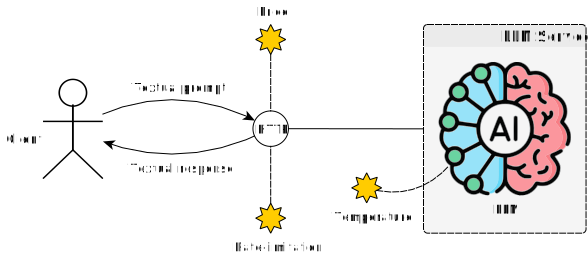

- Text in (__query__, a.k.a. _prompt_) $\rightarrow$ Text out (__response__, a.k.a. _completion_)
- __Pre-trained__ on the _publicly accessible_ Web (allegedly) $\Rightarrow$ plenty of _domain-specific_ knowledge, for most domains 
- __X-as-a-Service__ paradigm $\Rightarrow$ _pay-per-use_ + _rate limits_
- __Temperature__ parameter $\rightarrow$ regulates _creativity_ ($\approx$ randomness) of the response

---

## Contribution

> __Insight__: replace domain experts with _large language models_ (LLMs),
> <br/>
> treating them as __oracles__ for _automating_ ontology population

Let's discuss _how_!

---

## Problem statement (pt. 1)

+ Stemming from:
    1. a _partially_- (or, possibly, _non_-)instantiated __ontology__ $\mathcal{O} = \mathcal{C} \cup \mathcal{P} \cup \mathcal{X}$ consisting of:
        + a _non-empty_ set of __concept__ definitions $\mathcal{C}$
        + a _non-empty_ set of __property__ definitions $\mathcal{P}$
        + a _possibly-empty_ set of __assertions__ $\mathcal{X}$ 

    2. a __subsumption__ (a.k.a. _sub-class_) __relation__ $\sqsubseteq$ between concepts in $\mathcal{C}$
        + spawning a _directed acyclic graph_ (DAG) of concepts

    3. a trained LLM oracle $\mathcal{L}$

    4. a set of __query templates__ $\mathcal{T}$ for generating prompts for $\mathcal{L}$

+ ... produce $\mathcal{X}' \sqsupset \mathcal{X}$ such that:
    1. $\mathcal{X}'$ contains __novel__ individual and role assertions (w.r.t. $\mathcal{X}$)
    2. all assertions in $\mathcal{X}'$ are __consistent__ w.r.t. $\mathcal{C}$ and $\mathcal{P}$, meaning that
        + each individual in $\mathcal{X}'$ is assigned to the _most adequate_ concept in $\mathcal{C}$
        + $\mathcal{X}'$ contains role assertions matching the properties in $\mathcal{P}$ _as well as_ __reality__

---

## Problem statement (pt. 2)

### Example

{}
{}{}
{}

{}
{}$\xrightarrow{\text{after}}${}
{}

{}
{}

---

{}

## KgFiller

Our algorithm for _ontology population_ through LLM, stepping through __4 phases__:

1. __population__ phase: each concept in $\mathcal{C}$ is _populated_ with a set of individuals

2. __relation__ phase: each property in $\mathcal{P}$ is _populated_ with a set of role assertions
    + as a by-product, some concepts may be _populated_ even further

3. __redistribution__ phase: some individuals are _reassigned_ to more __adequate__ concepts

4. __merge__ phase: _similar_ individuals are _merged_ into a single one
    + $\approx$ duplicates removal

---

## About templates

> __Templates__ $\approx$ a string _named placeholders_ to be _filled_ with actual values via _interpolation_
+ think of them as C's `printf` format strings
    + e.g. `"Hello <WHO>" / {WHO -> "world!"} = "Hello world!"`

<br/>

{}

Each phase leverages templates of different sorts:

- __Individual seeking__ templates, e.g. `"Give me examples of <CONCEPT>"`
- __Relation seeking__ templates, e.g. `"Give me examples of <PROPERTY> for <INDIVIDUAL>"`
- __Best-match__ templates, e.g. `"What is the best concept for <INDIVIDUAL> among <CONCEPTS>?"`
- __Individuals merging__ templates, e.g. `"Are <INDIVIDUAL1> and <INDIVIDUAL2> the same <CONCEPT>?"`


{}

{}

---

{}

## About phases (pt. 1)

### Population phase

{}
<!-- {}{} -->
{}
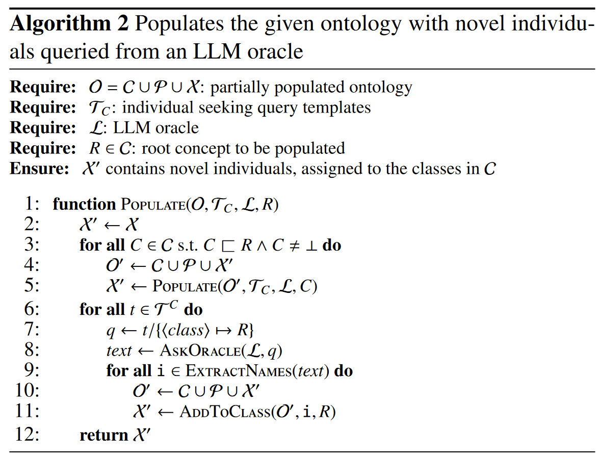
{}
{}
1. Focus on some class $R \in \mathcal{C}$ (most commonly `Thing`)

2. For each sub-class $C$ of $R$ (_post-order-DFS_ traversal):
    1. using some _individual seeking_ template $t \in \mathcal{T}$:
        1. ask $\mathcal{L}$ for _individuals_ of $C$ 
        3. _add_ the individuals to $\mathcal{X}'$ 

{}
{}

--- 

### Example (population)

{}
{}{}
{}

{}
{}$\xrightarrow{\text{after}}${}
{}

{}
{}

---

## About phases (pt. 2)

### Relate phase

{}
<!-- {}{} -->
{}
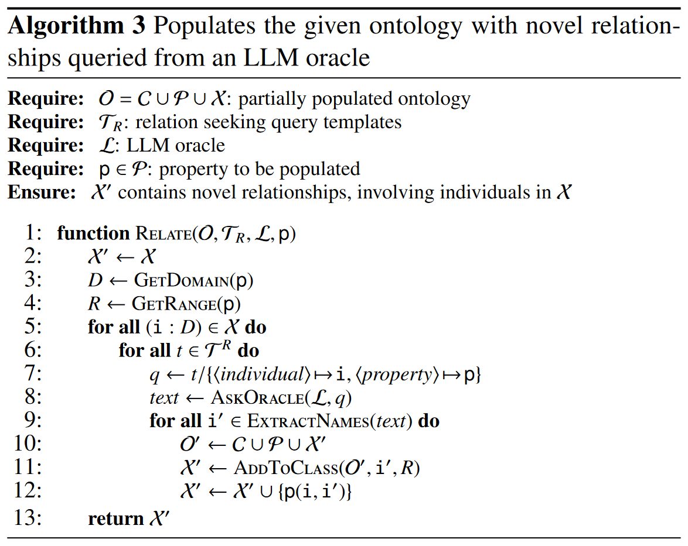
{}
{}
1. Focus on some property $\mathsf{p} \in \mathcal{P}$ 

2. Let $D$ (resp. $R$) be the _domain_ (resp. _range_) of $\mathsf{p}$

3. For each individual $\mathtt{i}$ in $D$: 
    1. using some _relation seeking_ template $t \in \mathcal{T}$:
        1. ask $\mathcal{L}$ for _individuals related_ to $\mathtt{i}$ by $\mathsf{p}$
        2. _add_ the individuals to $R$

{}
{}

---

### Example (relation)

{}
{}{}
{}

{}
{}$\xrightarrow{\text{after}}${}
{}

{}
{}

---

## About phases (pt. 3)

{}
<!-- {}{} -->
{}
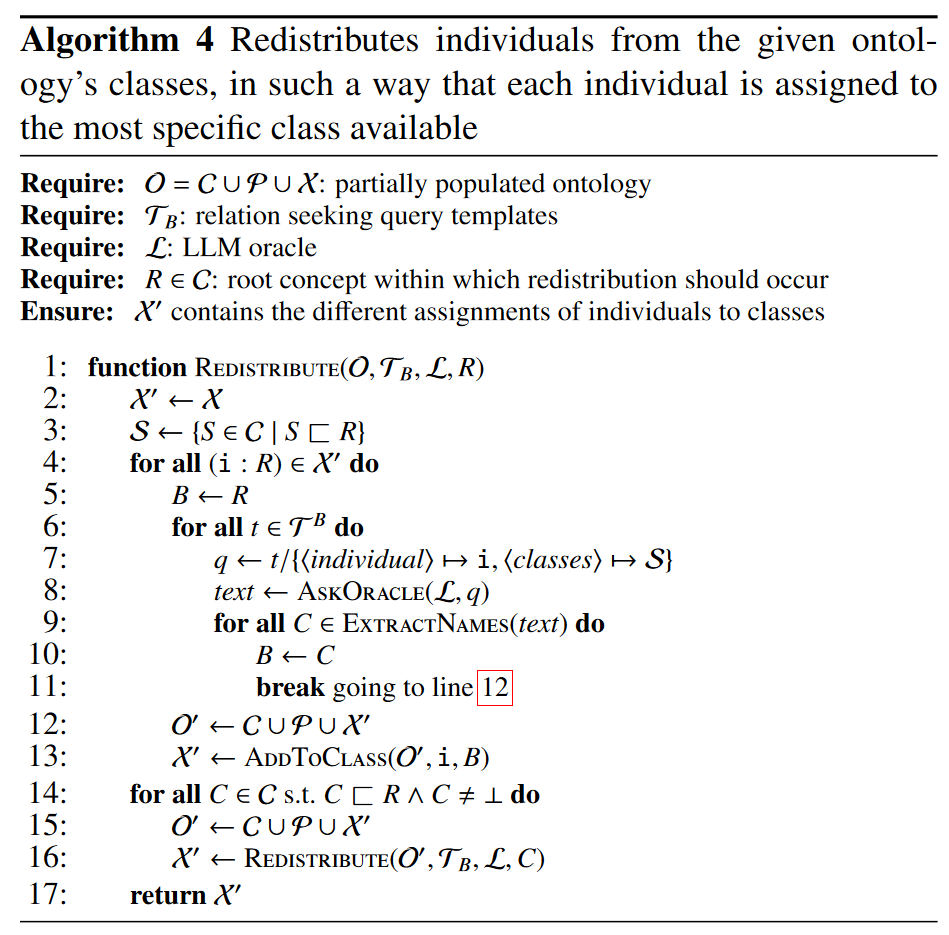
{}
{}
1. Focus on some class $R \in \mathcal{C}$ (most commonly `Thing`)

2. Let $\mathcal{S}$ be the set of all _direct_ sub-classes of $R$

3. For each individual $\mathtt{i}$ in $R$: 
    1. using some _best-match_ template $t \in \mathcal{T}$:
        1. ask $\mathcal{L}$ what is the _best class_ for $\mathtt{i}$ among the ones in $\mathcal{S}$
        2. _move_ $\mathtt{i}$ to the best class

4. Repeat for all _direct_ classes in $\mathcal{S}$
    + (this implies a _pre-order_-DFS traversal)

{}
{}

---

### Example (redistribute)

{}
{}{}
{}

{}
{}$\xrightarrow{\text{after}}${}
{}

{}
{}

---

## About phases (pt. 4)

{}
<!-- {}{} -->
{}
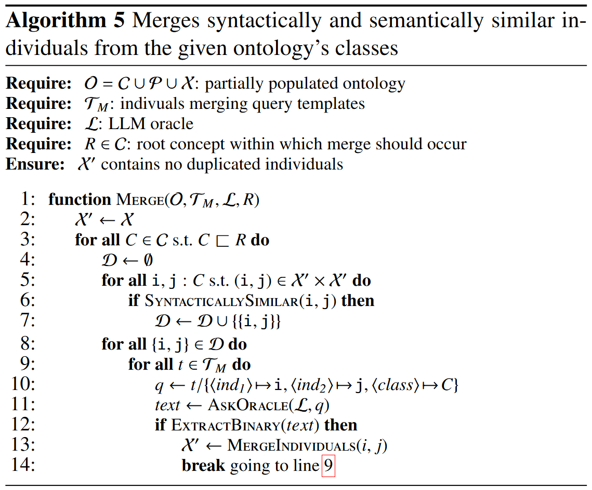
{}
{}
1. Focus on some class $R \in \mathcal{C}$ (most commonly `Thing`)

2. For each sub-class $C$ of $R$:
    1. for each _pair_ of _syntactically-similar_ individuals ${\mathtt{i}, \mathtt{j}}$:
        1. using some _individual-mergin_ template $t \in \mathcal{T}$:
            1. ask $\mathcal{L}$ if $\mathtt{i}$ and $\mathtt{j}$ are the _semantically-similar_
            2. if so, _merge_ $\mathtt{i}$ and $\mathtt{j}$ in $\mathcal{X}'$

{}
{}

{}

---

{}

## Practical aspects

### Prompt-engineering (pt. 1)

> __Problem__: queries may produce _verbose_ and _arbitrarily-structured_ responses, which are _costly_ and hard to _parse_

- Q: `"can you generate examples of cats?"`
- A: 
    ```text
    Certainly! While I can't physically generate images, I can certainly describe or provide information about different 
    types of cats. 
    Here are a few examples:
    
    1. Domestic Shorthair:
        Description: A common and popular cat breed known for its short, sleek coat.
        Characteristics: Versatile in colors and patterns, friendly, and adaptable.
    
    2. Siamese Cat:
        Description: Elegant and slender cat with distinctive color points.
        Characteristics: Vocal, social, and known for their striking blue almond-shaped eyes.
    
    ...
    
    10. Russian Blue:
        Description: Short-haired cat with a bluish-gray coat and striking green eyes.
        Characteristics: Reserved but affectionate, known for its plush double coat.
    ```

---

## Practical aspects

### Prompt-engineering (pt. 2)

> __Solution__: queries should explicitly ask for __conciseness__ and __structure__ to _spend less_ <br/> and _simplify parsing_ the response

- Q: `"list of cat races, names only"`
- A: 
    ```text
    Certainly, here's a list of cat breeds with names only:

    1. Persian
    2. Siamese
    ...
    10. Domestic Shorthair
    ```

---

## Practical aspects

### Avoiding out-of-context responses

> __Problem__: the query may be clear for the user, but _ambiguous_ for the LLM, 
> <br/> which may lead to _out-of-context_ responses

- Q: `"give me a list of examples of cats"`
- A: 
    ```text
    Certainly! Here are some examples of cats:

    1. Cat Stevens
    2. Catwoman
    ...
    10. Cat in the Hat
    ```

---

## Practical aspects

### Avoiding out-of-context responses

> __Solution__: provide the context _explicitly_ in the query
> <br/> Beware! _Two_ contexts are always in place:
> 1. the _domain_ of the ontology
> 2. the _ontological_ jargon itself

- C: `"you're a zoologist creating and ontology about animals species."`
- Q: `"give me a list of examples of cats"`
- A: 
    ```text
    Certainly! Here are some examples of cat breeds:

    1. Persian
    2. Siamese
    ...
    10. Domestic Shorthair
    ```

---

## Practical aspects

### Mining relevant information from responses

> __Problem__: responses contain _way more_ information than needed, in _unstructured_ form

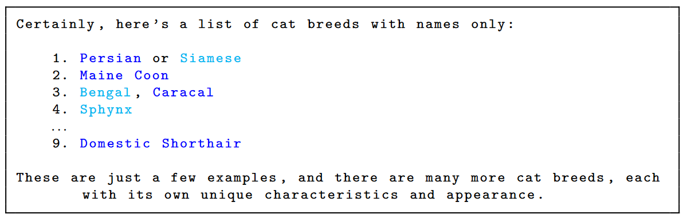

1. `Persian`, 2. `Siamese`, 3. `Maine Coon`, 4. `Bengal`, 5. `Caracal`, 6. `Sphinx`, ..., 10. `Domestic Shorthair`

--- 

## Practical aspects

### Mining relevant information from responses

> __Solution__: _parse_ the response to _extract_ the relevant information

{}
{}
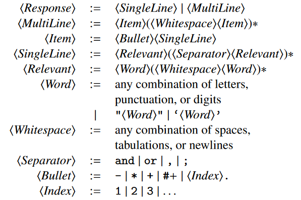
{}
{}
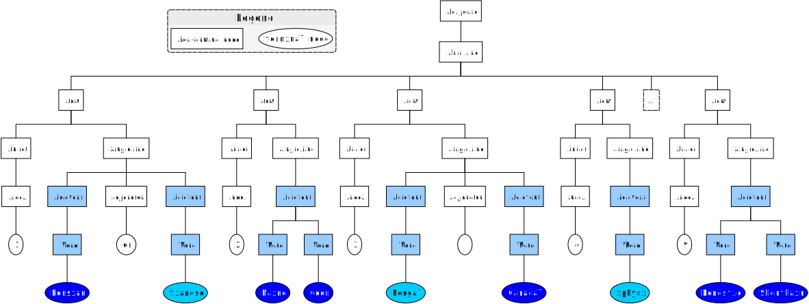
{}
{}

--- 

## Practical aspects

### Minimising financial costs

> __Problem__: cost model is most commonly _proportional_ to __consumed__ _and_ __produced__ _tokens_ (words)

{}

> __Solution__: ask for _conciseness_ + _limit_ responses' lengths + exploit _caching_

+ most _API_ support some `max_tokens`-like parameter
+ simple _cache mechanism_ can be implemented, using _prompt_ + _parameters_ as __key__

{}

---

## Practical aspects

### Handling rate limitations

> __Problem__: most LLM services apply _rate limitations_ on a __per-tokens__ or __per-requests__ basis 

{}

> __Solution__: apply [exponential back-off](https://en.wikipedia.org/wiki/Exponential_backoff) _retrial_ strategy + limit of _retries_ 

{}

{}

---

## Experimental setup

Experiments tailored in the _nutritional domain_

Reference ontology (built for the purpose):


+ plus role: __$Recipe \sqsubseteq \exists\mathsf{ingredientOf}.Edible$__ (all _recipes_ are made of _edible_ ingredients)

---

## Experimented LLMs

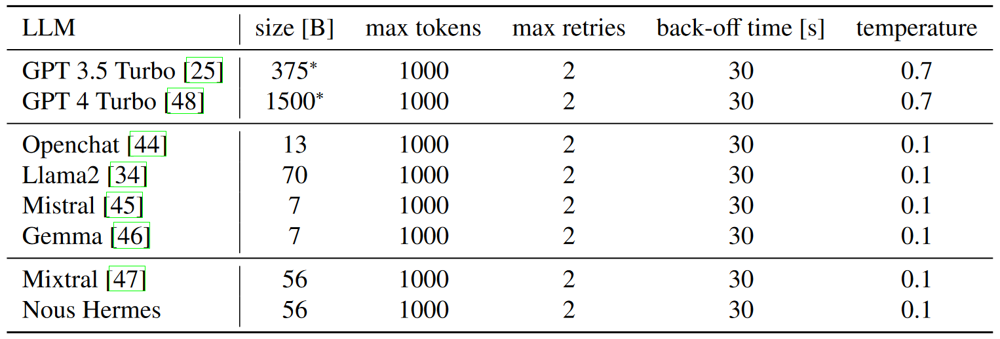

---

## Evaluation criteria (pt. 1)

### Types of errors

- __Misplacement__ error ($E_{mis}$): the _individual_ "belongs" the ontology, but it is _assigned to the wrong class_
    + e.g. $\mathtt{garfield} : Aniamal$, when $Cat \sqsubset Animal$ exists
    + or $\mathtt{tom} : Mouse$

- __Incorrect individual__ error ($E_{ii}$): the _individual makes no sense_ in the ontology, yet it has a _meaningful_ name
    + e.g. $\mathtt{catwoman} : Cat$

- __Meaningless individual__ error ($E_{mi}$): the _individual_ makes _no sense_ __at all__
    + e.g. $\mathtt{asanaimodelblablabla} : Mouse$

- __Class-like individual__ ($E_{ci}$): the _individual_ has a _name_ which is _very similar_ to the one of a _concept_ in the ontology
    + e.g. $\mathtt{cat} : Cat$

- __Duplicate individuals__ ($E_{di}$): the _individual_ is a _semantic duplicate_ of another one in the ontology
    + e.g. $\mathtt{pussy}, \mathtt{kitty} : Cat$

- __Wrong relation__ ($E_{wr}$): the _relation_ connecting _two individuals_ is _semantically wrong_
    + e.g. $\mathsf{ingredientOf}(\mathtt{pineapple}, \mathtt{pizza})$ 😇

---

## Evaluation criteria (pt. 2)

### Metrics

- __$TI$__: _total_ amount of generated _individuals_ in the whole ontology
- __$minCW$__ (resp. __$maxCW$__): minimum (resp. maximum) _class weight_, i.e. amount of individuals _in a class_
- __$TL$__: _total_ amount of individuals in __leaf__ classes
- __$TE$__: _total_ amount of individuals _affected by errors_
- __$RIE = \frac{TE}{TI}$__: _relative_ amount of individuals _affected by errors_ w.r.t. the _total_ amount of individuals
- **$E_{mis}$**, **$E_{ii}$**, **$E_{mi}$**, **$E_{ci}$**, **$E_{di}$**, **$E_{wr}$**: total amount of errors for each type of error
- __$TR$__: _total_ amount of _role_ assertions in the whole ontology
- **$RRE = \frac{E_{wr}}{TR}$**: _relative_ amount of _role_ assertions _affected by errors_ w.r.t. the _total_ amount of _role_ assertions

---

## Results

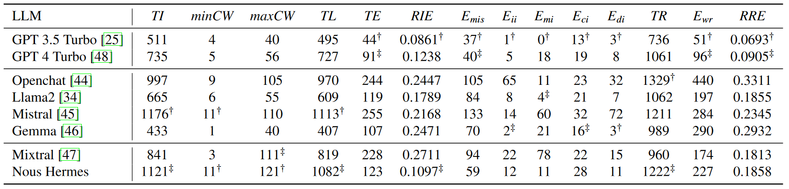

- Errors are spotted by _manual_ inspection!

---

## Highlights

- __Mistral__ gives the _bigger_ ontolgoies, but with `~21.6%` $RIE$
- __GPT-3__ gives the _smaller_ ontologies, but with `~8.6%` $RIE$ 
- Overall, most experiments' $RIE$ is _below_ `25%` (except for __Mixtral__)
- __GPT-*__ have the _best_ $RIE$

---

## About the implementation

- Code: <https://github.com/Chistera4-Expectation/kg-filler>
- Experiment data: <https://github.com/Chistera4-Expectation/knowledge-graphs>
    + each experiment is on a different _branch_:
        ```
        experiments/food-SERVICE-MODEL-DATE-HOUR-ID
        ```

    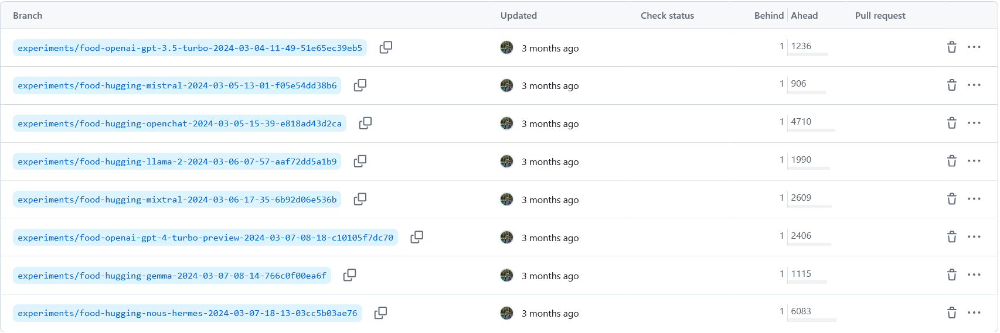

---

## About the experiments


Each _commit_ of each experiment _branch_ represents a _consistent_ update to the ontology: 

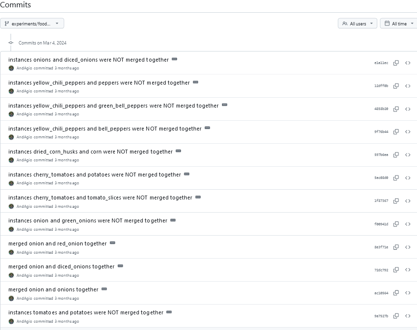
+ this was very useful in the _fine-tuning_ phase of the algorithm